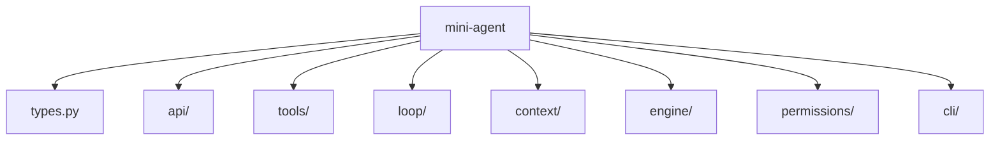
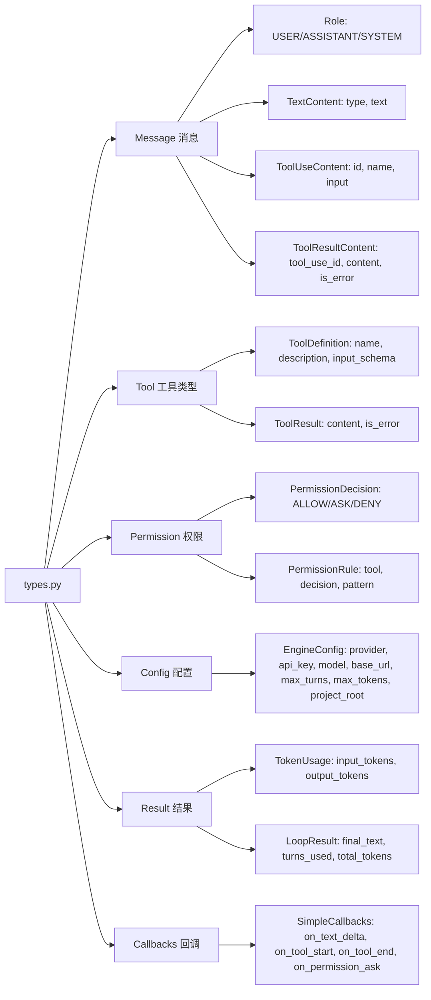
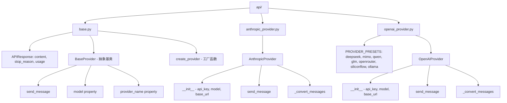
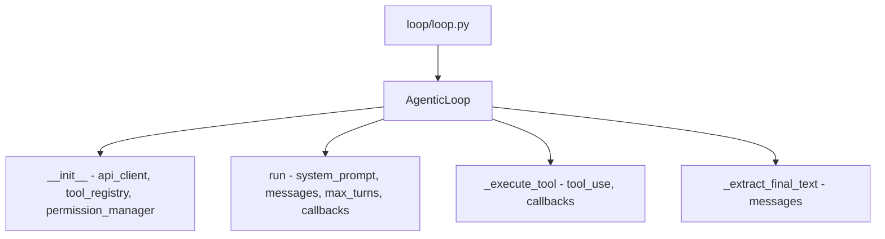
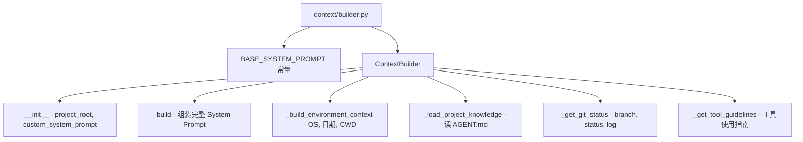
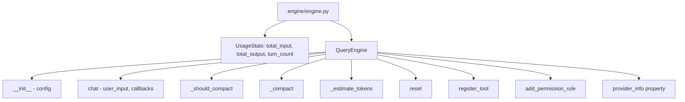
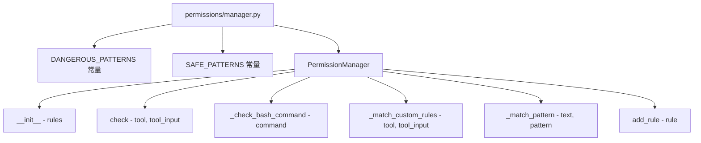
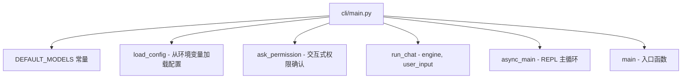

# 思维导图 1：项目文件结构 + 方法清单

## 项目总览

## 各模块详细结构

### types.py — 核心类型

### api/ — 通信层

### tools/ — 工具层

```mermaid
graph TD
    TOOLS[tools/] --> TB[base.py]
    TOOLS --> TI[__init__.py]
    TOOLS --> FR[file_read.py]
    TOOLS --> FW[file_write.py]
    TOOLS --> FE[file_edit.py]
    TOOLS --> BA[bash.py]
    TOOLS --> GL[glob.py]
    TOOLS --> GR[grep.py]

    TB --> Tool[Tool 抽象基类]
    Tool --> t_name[name property]
    Tool --> t_desc[description property]
    Tool --> t_schema[input_schema property]
    Tool --> t_readonly[is_read_only property]
    Tool --> t_call[call - 执行工具]
    Tool --> t_def[to_definition]

    TB --> ToolRegistry[ToolRegistry]
    ToolRegistry --> tr_register[register]
    ToolRegistry --> tr_all[register_all]
    ToolRegistry --> tr_get[get]
    ToolRegistry --> tr_getall[get_all]
    ToolRegistry --> tr_defs[to_definitions]
    ToolRegistry --> tr_has[has]

    TI --> create_default[create_default_tool_registry]

    FR --> FileReadTool[FileReadTool - call: file_path, offset, limit]
    FW --> FileWriteTool[FileWriteTool - call: file_path, content]
    FE --> FileEditTool[FileEditTool - call: file_path, old_string, new_string]
    BA --> BashTool[BashTool - call: command, cwd, timeout]
    GL --> GlobTool[GlobTool - call: pattern, cwd]
    GR --> GrepTool[GrepTool - call: pattern, path, include]
```

### loop/ — 核心循环层

### context/ — 上下文层

### engine/ — 编排层

### permissions/ — 权限层

### cli/ — 入口层

---

## 文字版总结表格

| 文件 | 类/函数 | 方法 |
|------|---------|------|
| `types.py` | `EngineConfig` | provider, api_key, model, base_url, max_turns, max_tokens |
| `types.py` | `SimpleCallbacks` | on_text_delta, on_tool_start, on_tool_end, on_permission_ask |
| `api/base.py` | `BaseProvider` | `send_message()`, `model`, `provider_name` |
| `api/base.py` | `create_provider()` | 工厂函数，根据 provider 名创建实例 |
| `api/anthropic_provider.py` | `AnthropicProvider` | `send_message()`, `_convert_messages()` |
| `api/openai_provider.py` | `OpenAIProvider` | `send_message()`, `_convert_messages()` |
| `tools/base.py` | `Tool` (ABC) | `name`, `description`, `input_schema`, `is_read_only`, `call()`, `to_definition()` |
| `tools/base.py` | `ToolRegistry` | `register()`, `register_all()`, `get()`, `get_all()`, `to_definitions()`, `has()` |
| `tools/__init__.py` | `create_default_tool_registry()` | 创建并注册 6 个默认工具 |
| `tools/file_read.py` | `FileReadTool` | `call(file_path, offset, limit)` |
| `tools/file_write.py` | `FileWriteTool` | `call(file_path, content)` |
| `tools/file_edit.py` | `FileEditTool` | `call(file_path, old_string, new_string)` |
| `tools/bash.py` | `BashTool` | `call(command, cwd, timeout)` |
| `tools/glob.py` | `GlobTool` | `call(pattern, cwd)` |
| `tools/grep.py` | `GrepTool` | `call(pattern, path, include)` |
| `loop/loop.py` | `AgenticLoop` | `run()`, `_execute_tool()`, `_extract_final_text()` |
| `context/builder.py` | `ContextBuilder` | `build()`, `_build_environment_context()`, `_load_project_knowledge()`, `_get_git_status()`, `_get_tool_guidelines()` |
| `engine/engine.py` | `QueryEngine` | `chat()`, `_should_compact()`, `_compact()`, `_estimate_tokens()`, `reset()`, `register_tool()`, `add_permission_rule()` |
| `permissions/manager.py` | `PermissionManager` | `check()`, `_check_bash_command()`, `_match_custom_rules()`, `_match_pattern()`, `add_rule()` |
| `cli/main.py` | 顶层函数 | `load_config()`, `ask_permission()`, `run_chat()`, `async_main()`, `main()` |
