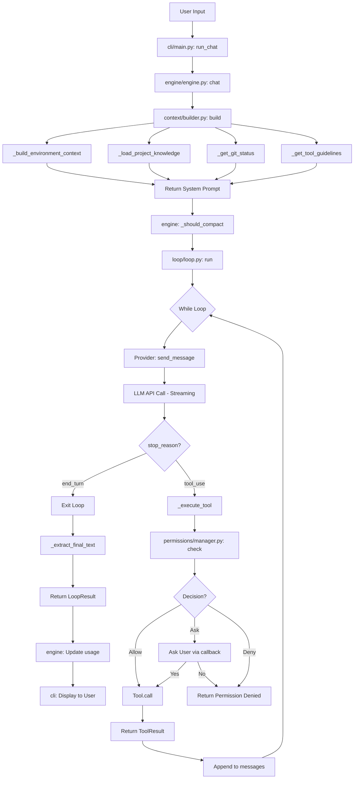
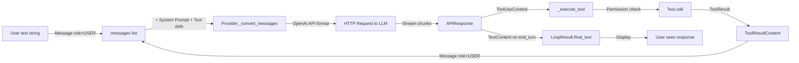

# 思维导图 2：用户提问到 Agent 回复的完整流程

## 完整请求流程图

```mermaid
sequenceDiagram
    participant User as User
    participant CLI as cli/main.py
    participant Engine as engine/engine.py
    participant Context as context/builder.py
    participant Loop as loop/loop.py
    participant Provider as api/openai_provider.py
    participant LLM as LLM API
    participant Permission as permissions/manager.py
    participant Tool as tools/file_read.py

    Note over User,Tool: Phase 1 - User Input

    User->>CLI: Input text
    CLI->>CLI: main -> async_main -> run_chat
    CLI->>Engine: engine.chat(user_input, callbacks)

    Note over User,Tool: Phase 2 - Context Assembly

    Engine->>Engine: Append user message to messages list
    Engine->>Context: context_builder.build()
    Context->>Context: _build_environment_context
    Context->>Context: _load_project_knowledge
    Context->>Context: _get_git_status
    Context->>Context: _get_tool_guidelines
    Context-->>Engine: Return full System Prompt

    Note over User,Tool: Phase 3 - Agentic Loop

    Engine->>Engine: _should_compact check
    Engine->>Loop: loop.run(system_prompt, messages, max_turns, callbacks)

    Loop->>Provider: send_message(system_prompt, messages, tools)
    Provider->>Provider: _convert_messages
    Provider->>LLM: HTTP POST streaming request
    LLM-->>Provider: Stream chunks with tool_calls
    Provider-->>CLI: on_text_delta callback
    Provider-->>Loop: APIResponse with ToolUseContent

    Loop->>Loop: stop_reason is tool_use

    Note over User,Tool: Phase 4 - Tool Execution

    Loop->>Permission: check(tool, tool_input)
    Permission->>Permission: is_read_only is True
    Permission-->>Loop: ALLOW

    Loop->>CLI: callbacks.on_tool_start
    Loop->>Tool: FileReadTool.call(file_path)
    Tool-->>Loop: ToolResult with file content
    Loop->>CLI: callbacks.on_tool_end

    Loop->>Loop: Append tool result to messages

    Note over User,Tool: Phase 5 - Second LLM Call

    Loop->>Provider: send_message with tool results
    Provider->>LLM: Second request with file content
    LLM-->>Provider: Final text response
    Provider-->>CLI: on_text_delta callback
    Provider-->>Loop: APIResponse stop_reason is end_turn

    Loop->>Loop: Exit loop

    Note over User,Tool: Phase 6 - Return Result

    Loop->>Loop: _extract_final_text
    Loop-->>Engine: LoopResult
    Engine->>Engine: Update usage stats
    Engine-->>CLI: Return LoopResult
    CLI-->>User: Display response
```

## 流程分层图



## 数据变换流程



---

## 文字版流程总结

```
1. 用户输入文本
   ↓
2. cli/main.py: run_chat() 创建 callbacks, 调用 engine.chat()
   ↓
3. engine/engine.py: chat()
   - 将用户消息加入 messages
   - 调用 context_builder.build() 组装 System Prompt
   - 检查 _should_compact() 是否需要压缩
   - 调用 loop.run() 进入循环
   ↓
4. loop/loop.py: run() — 核心循环
   ┌─────────────────────────────────────────────────────┐
   │ while turns < max_turns:                             │
   │   a. provider.send_message() → 调 LLM API (流式)     │
   │   b. 解析响应 → 加入 messages                        │
   │   c. 如果 stop_reason == end_turn → 退出循环         │
   │   d. 如果 stop_reason == tool_use:                   │
   │      - permission_manager.check() → Allow/Ask/Deny   │
   │      - tool.call() → 执行工具                        │
   │      - 工具结果加入 messages                          │
   │      - 回到 a                                        │
   └─────────────────────────────────────────────────────┘
   ↓
5. _extract_final_text() → 提取最终文本
   ↓
6. 返回 LoopResult → engine 更新统计 → cli 显示给用户
```
